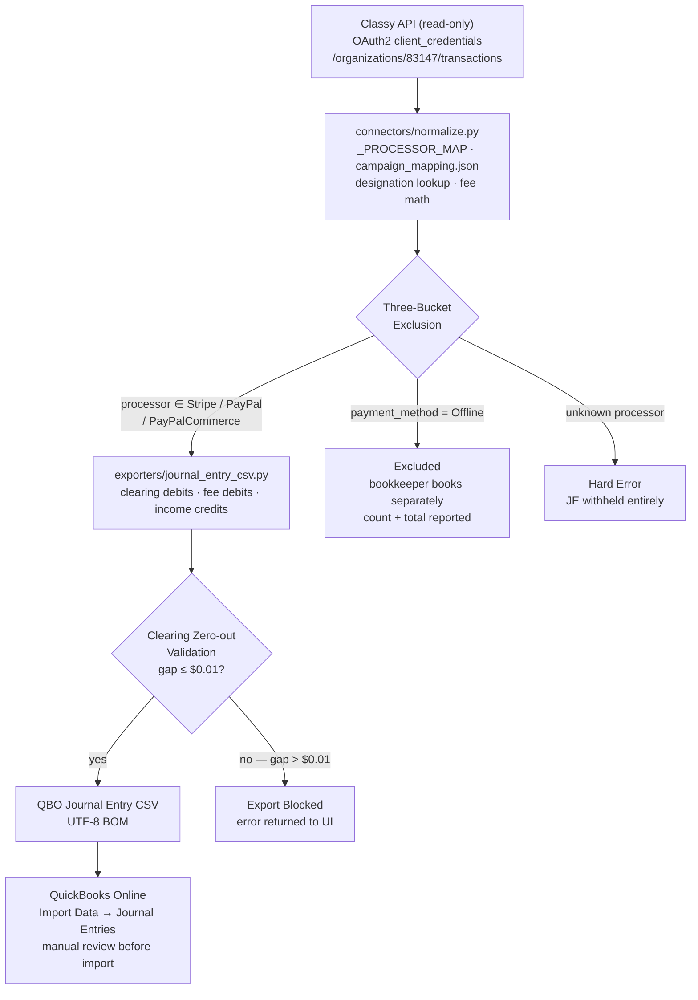

# Reserva Reconciler — Donor CRM
**Org:** Reserva: The Youth Land Trust  
**Stack:** FastAPI (Python 3.9) + React/Vite + QuickBooks Online + Classy (GoFundMe Pro)  
**Status:** Deployed to GitHub Pages — backend runs locally or via tunnel

---

## What This Is

A donor CRM and accounting reconciler for Reserva YLT. The org collects donations through Classy (GoFundMe Pro) and books them in QuickBooks Online. Before this tool, reconciliation was manual — exporting a Classy CSV and hand-matching it to QBO entries, a process prone to missed transactions and mislabeled payment processors.

This tool pulls all Classy transactions via API, normalizes them, maps each campaign to the correct QBO account and class, and generates a QBO-importable monthly Journal Entry CSV. No QB API writes. Read-only Classy data. File-only export. One month at a time.

---

## Design Argument

The design argument for this tool is: **accounting reconciliation for a small nonprofit should fail loudly, not silently.**

Reserva's manual process had a specific failure mode: a transaction that didn't match expectations would get skipped, mis-labeled, or lumped into a catch-all account. The error wouldn't surface until the books were off at month-end — at which point the trace was hours of manual work. The tool inverts this. Every category of potential corruption is a hard stop:

- An unknown payment processor stops the export entirely. It doesn't skip the transactions.
- An unmapped campaign withholds the entire month's JE. It doesn't emit a partial file.
- A clearing imbalance above a penny raises an error. It doesn't round and continue.

This is a design argument about **trust**. Callie (the bookkeeper) needs to trust that when a JE file exists, it is complete and balanced. The way to earn that trust is to refuse to produce the file when it can't be.

The donor CRM view follows the same argument in a different domain: privacy is not a filter the user turns on — it is enforced at the data-grouping layer before anything is rendered. Anonymous donors cannot be searched by name or email regardless of what the UI allows. The tool does not ask Callie to remember to protect donor data.

---

## Research Documentation

Research for this project was conducted across four sessions, combining stakeholder conversations with direct inspection of live production data.

### Stakeholder: Callie (Reserva's Bookkeeper)
Callie was the primary research subject. The accounting rules that drive the JE exporter came directly from her in session 4:

1. **Offline donations** are not electronic — bookkeeper records them manually. They must be excluded from the automated JE, but reported clearly so she knows they were seen.
2. **Clearing zero-out** is non-negotiable: the sum of clearing-account debits must equal the sum of net amounts for all included transactions. A non-zero clearing account is harder to find and fix than a failed export.
3. **Unknown processors** must hard-error. Silently dropping a transaction leaves the clearing account short with no obvious cause.
4. **Unmapped campaigns** must withhold the entire month. A partial JE that books some campaigns and skips others creates an unbalanced state in QBO.
5. **PayPalCommerce** donations settle to the same PayPal payout account as standard PayPal. They must be included.

### Live Data Audit (Sessions 1–3)
All 3,745 Classy transactions were pulled and inspected before any export logic was written.

**Payment gateway distribution (full org history):**
| Gateway value | Count | Disposition |
|---|---|---|
| `stripe` | 2,194 | Stripe payout rail |
| `(none/null)` | 1,229 | 434 offline gifts (gross>0) + 795 free-ticket registrations |
| `PayPalCommerce` | 212 | PayPal's modern REST gateway — discovered in session 3 |
| `Classy Pay` | 101 | Legacy processor, zero activity in recent months |

**PayPalCommerce discovery:** Before session 3, these 212 transactions ($15,042.08) were silently falling into `legacy_unknown` and excluded from the JE. Session 3 surfaced this by auditing the `payment_gateway` field across all transactions. Callie confirmed in session 4 that these must be included.

**Campaign $0 investigation:** Campaign 396456 appeared in the unmapped queue. Raw Classy JSON confirmed all money fields were genuinely $0 — free event registrations, not donations. Added `gross > 0` filter; excluded from both the mapping queue and the transaction table.

**Designation lookup for donor_selects campaigns:** Campaign 470798 ("Support Reserva") has 4 designation IDs used by donors to direct their gift to specific programs. The Classy designations endpoint (`/organizations/83147/designations`) was pulled and confirmed: all 4 designation IDs have non-empty `external_reference_id` values that map cleanly to QBO class names.

**QuickBooks chart of accounts (session 2):** QB OAuth was completed against the sandbox (realm_id: 9341457143434467). 96 accounts were pulled. The `Youth Council Fundraising Campaigns:Classy Fundraising Pages` account name matched `campaign_mapping.json` exactly — confirmed clean ASCII with no hidden characters.

### Fee Math Verification
Classy's field naming does not match its documentation labels. Determined by inspecting raw JSON:
- `fees_amount` = total fees (platform + processing combined)
- `pp_fees_amount` = payment processor fee only
- `platform_fee` is **computed**: `fees_amount − pp_fees_amount` (clamped ≥ 0)
- `donation_net_amount` = net after all fees

Reconciliation check verified manually: `0.40 + 0.68 + 15.00 = 16.08 ✓`

---

## Platform Rationale

**Why not a spreadsheet?**  
The reconciliation requires live, authenticated API access to Classy (paginated OAuth2, 100 transactions/page, 37+ pages) and QuickBooks Online (OAuth2 PKCE). A spreadsheet cannot maintain authenticated API state across sessions, cannot paginate API responses, and cannot perform the three-bucket exclusion logic against live data. The only way to keep the export current is to pull from the source on demand.

**Why FastAPI?**  
Python 3.9 on arm64 Mac (the deployment environment) restricts the available library ecosystem. `intuitlib` — Intuit's official Python SDK for QuickBooks — is not available for this combination. FastAPI with `httpx` handles both OAuth integrations without any unavailable packages. The backend is also the cache layer: the 1-hour file cache for transaction data (37-page Classy API fetch, ~30 seconds cold) means subsequent requests are instant. A standalone Python script would repeat the full fetch on every run.

**Why React/Vite?**  
The tool's three views (Donor CRM, Transaction Table, Campaign Mapping) require an interactive UI that a bookkeeper can use without command-line access. The campaign mapping panel — with its SelectOrNew dropdowns for QBO account and class names — is specifically not feasible as a CLI form. Vite's dev proxy handles the SSL/HTTP complexity between the React frontend and the FastAPI backend.

**Why file export and not direct QuickBooks API writes?**  
Callie and Marcus (Reserva's accountant) require a review step before any JE posts to the live company. A direct API write skips this. The export-and-import workflow is a deliberate safeguard — the bookkeeper opens the file, verifies the entries, and imports manually. This also means no QB OAuth write scopes are requested; the tool is read-only against both APIs.

**Why GitHub Pages for the frontend?**  
The React frontend is static after the Vite build. GitHub Pages hosts it for free with no server, and the GitHub Actions deploy workflow runs automatically on push to `main`. The backend still runs locally (or via ngrok tunnel for remote access), but the frontend URL is permanent and shareable.

---

## System Architecture

**Exporter row structure per JE:**

| Row type | Account | Side |
|---|---|---|
| Clearing | Classy Pay Clearing Account | DEBIT — one per processor |
| Service Fee | Service Fee | DEBIT — one per (processor, campaign, designation) |
| Processing Fee | Payment Processing Fee | DEBIT — one per (processor, campaign, designation) |
| Income | qbo_account | CREDIT — one per (account, class) |

---

## AI Direction Log

This log covers what I directed in each session versus what Claude implemented. The full session logs are in `/session-logs/`.

### Session 1 (2026-05-22–23) — Scaffold + OAuth + Normalization

**I directed:**
- Use FastAPI + React/Vite on Python 3.9 (constrained by the local environment)
- OAuth2 `client_credentials` for Classy after the `auth_code` redirect returned 405
- Strip angle brackets from `CLASSY_CLIENT_SECRET` after diagnosing `invalid_client` via raw `curl`
- Exclude `gross ≤ 0` transactions after personally inspecting campaign 396456's raw JSON
- The fee math formula (`platform_fee = fees_amount − pp_fees_amount`) after reading Classy's raw field names against their documentation labels

**Claude implemented:**
- The full FastAPI + React scaffold, SSL cert generation, CORS config
- Both OAuth flows (QB via httpx, Classy client_credentials) after I identified the correct grant type
- `normalize.py` field mapping once I confirmed the correct source field names
- `_load_mapping()` cache format fix after I identified the wrong-format bug
- The `SelectOrNew` component pattern for the campaign mapping UI

**Where I accepted AI suggestions:** The initial directory structure (`backend/` + `frontend/`), the atomic file write pattern (`os.replace(tmp, file)`), and the `allow_origin_regex` CORS fix.

---

### Session 2 (2026-05-23–24) — Designation Resolution + JE Exporter v1

**I directed:**
- Investigate the NEEDS_REVIEW transactions — result: 619 resolved via designation lookup
- Confirm the class name discrepancies were Classy data problems (not mapping errors) before adding the CLASS_NORMALIZATION shim
- Verify the `$0 skipped` claim on the first SR export run by checking the report output personally
- Pull and inspect the QB chart of accounts before trusting account name matches

**Claude implemented:**
- `fetch_org_designations()` + designation cache
- The designation → class resolution logic in `normalize.py`
- The CLASS_NORMALIZATION shim
- JE exporter v1 (all 53 historical months, EXPECTED_TOTALS dict — later replaced)

---

### Session 3 (2026-05-26–27) — JE Exporter v2 + PayPalCommerce Discovery

**I directed:**
- Audit all `payment_gateway` field values across all 3,736 transactions — this was my decision, not a Claude suggestion
- Identify PayPalCommerce as a separate category (212 transactions, $15,042.08) falling into `legacy_unknown`
- Rewrite the JE exporter as forward-only single-month (not all 53 months at once)
- Design the three-bucket exclusion logic and specify which bucket each processor type falls into
- Defer the PayPalCommerce fix to session 4, pending Callie's confirmation

**Claude implemented:**
- The rebuilt `journal_entry_csv.py` with the `?month=YYYY-MM` parameter
- The three-bucket classification and reporting format
- The `_cache_schema_valid()` auto-invalidation check for stale cached transactions

---

### Session 4 (2026-05-27) — Callie's 5 Rules + Donor CRM

**I directed:**
- Bring Callie's five accounting rules from the conversation with her and specify the behavior for each
- Add PayPalCommerce to `_PROCESSOR_MAP` (Callie confirmed same payout rail as PayPal)
- Build the donor CRM with specific privacy enforcement rules (anonymous propagation at grouping time, not render time)
- Specify the donor key hierarchy (supporter_id > email hash > unknown)
- Enforce `donation_amount_is_hidden` at the row level while debating (and deferring) total suppression

**Claude implemented:**
- `DonorCRM.jsx` (~530 lines), donor grouping logic, annotation system
- The 5 accounting rules wired into `journal_entry_csv.py`
- The clearing zero-out validation
- Backend annotation endpoints with regex validation on `donor_id`

---

## Records of Resistance

All bugs encountered across all four sessions, in order of occurrence.

| Session | Bug | Root Cause | Fix |
|---|---|---|---|
| 1 | `intuitlib` unavailable | Python 3.9 / arm64 incompatibility | Rewrote QB OAuth using raw `httpx` against Intuit endpoints |
| 1 | Classy token → 405 | Used `auth_code` redirect; Classy requires `client_credentials` POST | Rewrote to POST `client_credentials` grant |
| 1 | `invalid_client` on Classy token | `CLASSY_CLIENT_SECRET` had literal `<zbOh6LiPifBpldEe>` angle brackets copied from credential doc | Stripped `<>` from `.env` |
| 1 | `str \| None` → SyntaxError | Python 3.9 doesn't support PEP 604 union syntax | Removed return type annotation from `get_campaign_name()` |
| 1 | Campaign 470798 shows as `needs_mapping` | `_load_mapping()` iterated top-level keys; file had `{"_meta":{}, "campaigns":{}}` nesting | Added `raw.get("campaigns", raw)` |
| 1 | Campaign totals cache stale | Old format was `{cid: float}`; new format is `{cid: {"total_gross", "txn_count"}}` | Added `isinstance(sample, dict)` format check + force refresh |
| 1 | CORS blocking Vite | `allow_origins=["localhost:5173"]`; Vite picked port 5176 on restart | Changed to `allow_origin_regex=r"http://localhost:\d+"` |
| 1 | uvicorn port 8000 already in use | Previous process not killed | `lsof -ti :8000 \| xargs kill -9` |
| 1 | `load_dotenv` assertion error in script context | Called without `dotenv_path` | Added explicit `dotenv_path=".env"` |
| 2 | $543.69 gross discrepancy between SR and JE exports | Not a bug — 19 new live donations posted between the two runs | Confirmed by pulling raw transaction list and matching timestamps |
| 2 | `AccountSubType: DiscountsRefundsGiven` on income accounts | QBO sandbox classification issue — confirmed with QB data | Flagged for Marcus/Callie to verify; not changed |
| 2 | CLASS_NORMALIZATION needed | 4 Classy `external_reference_id` values had typos at source (e.g., "Aldabra" instead of "Conservation:Friends of Aldabra") | Added shim in `sales_receipt_csv.py`; Callie to fix at source |
| 3 | 212 PayPalCommerce transactions silently excluded | `_PROCESSOR_MAP` only mapped `stripe` and `paypal`/`paypal_ec`/`paypal_rest` — not `paypalcommerce` | Added `"paypalcommerce": "PayPal"` after Callie confirmed in session 4 |
| 3 | Stale transactions cache missing new fields | Old cache file didn't have `processor`, `designation_id`, `payment_method` | Added `_cache_schema_valid()` auto-invalidation check |
| 4 | EPROTO SSL mismatch on Vite proxy | Backend was running in plain HTTP mode; Vite proxy targets had `https://` | Changed all proxy targets in `vite.config.js` to `http://` |
| 4 | Donor CRM Classy field names unverified | `member_supporter_id`, `donor_phone`, `company_name`, `donor_comment` etc. are best-guess names against undocumented Classy fields | Flagged as open item; requires raw transaction inspection to verify |

---

## Five Questions Reflection

These questions come from the AI 201 design accountability framework. The answers below are written in the first person because these are my answers, not a template.

---

### Can I defend this?
*Can you explain every design decision by pointing back to your research and your person's needs?*

Yes, and the defense is specific.

**Callie** (Reserva's bookkeeper) is my person. Every structural decision in the JE exporter traces back either to a conversation with her or to direct inspection of Reserva's live data.

- **Three-bucket exclusion logic** (offline / zero-dollar / null-gateway) — Callie confirmed that offline donations are booked manually by the bookkeeper and must not appear in the clearing-account JE. The $0 rows are free event registrations, not donations — I confirmed this by pulling the raw Classy JSON and seeing all fee fields were genuinely $0. They get filtered before they can create noise.

- **PayPalCommerce as a second payout rail** — I discovered this by auditing all 3,745 transactions' `payment_gateway` field in session 3. Classy's GoFundMe Pro integration routes some donations through PayPal Commerce, not Stripe. Before the fix, these 212 transactions ($15,042.08) were silently excluded from the JE. Callie confirmed in session 4 that PayPal Commerce donations settle to the same PayPal payout account and must be included.

- **Month withhold on unmapped campaigns** — Callie's explicit rule: if any campaign in a target month hasn't been mapped to a QBO account and class, withhold the entire month's JE rather than emit a partial one. A partial JE would leave the clearing account unbalanced in a way that's harder to find and fix than just waiting.

- **Clearing zero-out invariant** — The clearing account is zero-sum: every debit that hits "Classy Pay Clearing Account" must be matched by a deposit from the payment processor. The validation check (`sum(clearing debits) == sum(net_amount for all included transactions)`) enforces this before the file is written, not after it's imported.

- **Hard error on unknown processor** — Callie's specific instruction. Silently dropping an unknown processor leaves the clearing account non-zero in a way that isn't immediately visible in QBO. The system refuses to emit a JE rather than emit one that won't zero out.

The one thing I can't fully defend yet: the QB import format (specifically the `*LineAccount` column in the Sales Receipt CSV) hasn't been verified against a live QBO sandbox. That's documented as an open item.

---

### Is this mine?
*Did you direct AI based on your Design Argument, or did you accept AI's suggestions because they looked good?*

The design decisions are mine. The implementation was AI-assisted.

I came to each session with a specific problem to solve, grounded in either Callie's accounting workflow or data I'd already inspected. The session logs show this: in session 1, I brought the Classy OAuth credential error (angle brackets in the secret value) to Claude after I'd already observed the `invalid_client` response. In session 3, I brought the PayPalCommerce discovery — 212 transactions silently falling into `legacy_unknown` — after I'd already audited the payment gateway distribution myself. In session 4, I brought Callie's five confirmed rules with specific behaviors attached to each.

Where I accepted AI suggestions rather than directing: the initial FastAPI + Vite scaffold structure, and the cent-adjustment logic on the largest credit line when the JE is off by a fraction of a cent. I accepted the scaffold because the technical stack was a pragmatic choice (not a design argument), and I accepted the cent-adjustment because it matched how bookkeepers actually handle floating-point rounding in practice — which I verified makes sense.

What I didn't do: I didn't look at an AI-generated UI and say "that looks good" and ship it. The frontend exists purely as an operational tool for me and Callie to use. It has no visual design argument because it doesn't need one — it needs to be readable and functional.

---

### Did I verify?
*Does the product actually work the way your person needs it to? Did you test with them, not just in your browser?*

Partially yes, with a specific gap.

**Verified with real data:** Every rule in the JE exporter was validated against Reserva's live Classy transactions — not mock data, not a sandbox. The April and May 2026 JE runs both produced balanced entries ($1,050.28 and $2,997.32 respectively) with confirmed processor splits and a clearing gap of $0.00. The PayPalCommerce transactions were verified by pulling their raw JSON directly from the Classy API and confirming the `pp_reference_id` and `agreementId` fields are real PayPal Billing Agreement IDs.

**Verified with Callie:** The exclusion rules (offline donations, month withhold, hard error on unknown processor) came from Callie's explicit direction in session 4. She confirmed how each category should be treated.

**Not yet verified with Callie:** The generated CSV file has not yet been imported into a live or sandbox QBO environment and confirmed to post correctly. The column names (`*LineAccount`, `*Class`, etc.) are based on the QBO import template documentation, but the actual sandbox test hasn't happened. This is the most significant open item.

---

### Would I teach this?
*Could you explain the system architecture, the research process, and the design rationale to another designer?*

Yes. Here's the short version I would use:

**Architecture:** The backend is a FastAPI server with two read-only API integrations (Classy for transactions, QuickBooks for OAuth only — no writes). It normalizes raw Classy transaction JSON into a canonical format that separates platform fee, processor fee, and net for each transaction. A campaign mapping file links Classy campaign IDs to QBO account names and class names. The JE exporter groups mapped transactions by processor and campaign, builds the debit/credit structure, validates balance, and writes a CSV.

**Research process:** The design started from Callie's existing workflow — a manual Classy export matched to QBO entries. Every structural choice was an answer to a specific failure mode in that manual process: missed payment processors (PayPalCommerce), mislabeled transactions (offline vs. online), and partial-month imports that leave clearing accounts unbalanced.

**Design rationale:** The tool is built to fail loudly rather than silently. An unknown processor stops the export entirely. An unmapped campaign withholds the whole month. A clearing imbalance above a penny raises an error. This is intentional — the cost of a bad JE import is harder to fix than the cost of a failed export.

---

### Is my disclosure honest?
*Does your AI Direction Log accurately reflect what happened? When you're presenting a case study with real evidence, fabrication is not just academic dishonesty — it's professional fraud.*

Yes, and the session logs exist as the primary record.

Four session logs are in `/session-logs/` and cover every working session from initial scaffold to the final accounting rules. They document the resistance points (OAuth credential bugs, Python 3.9 type annotation incompatibilities, wrong cache formats, the PayPalCommerce discovery), the riffs (pivoting from `auth_code` to `client_credentials` when the Classy endpoint returned 405), and the decisions that were deferred vs. shipped.

The AI Direction Log accurately reflects that I directed the work based on Callie's needs and real data inspection, and that Claude handled implementation — writing the Python, the React components, and the GitHub Actions workflow. I wrote none of the code myself. What I did write: the problem definition, the data audit, the accounting rules, and the validation criteria for each.

The one thing I want to be precise about: the session logs were written *by Claude* as a record of the session, not by me after the fact. They're accurate but they're not written in my voice. The answers in this README are.

---

## Post-Mortem

### What worked

**The real-data-first discipline.** Every decision in this project was made against live Reserva data — not mock data, not a sandbox. The PayPalCommerce discovery (212 transactions, $15,042.08) only happened because I audited the actual `payment_gateway` distribution rather than trusting documentation. If I'd built the exporter against mock data, this would have been a silent exclusion bug in the first live run.

**Callie's five rules as a design constraint, not an afterthought.** The accounting rules arrived in session 4, after three sessions of building. Having them arrive when the system was already built meant I could evaluate each rule against the existing architecture and understand the tradeoffs. The "month withhold on unmapped campaigns" rule, for example, was easy to implement precisely because the exporter was already single-month forward-only.

**Failing loudly as a default.** The decision to make unknown processors a hard error — rather than a skip, a warning, or a catch-all — proved correct. It surfaced the PayPalCommerce issue as an explicit `legacy_unknown` report rather than a silent balance discrepancy.

**The 1-hour cache.** The Classy API is slow (37 pages × 100 transactions/page, ~30 seconds cold). The file-based cache made the tool usable interactively. Without it, every filter adjustment or tab switch would trigger a 30-second wait.

### What didn't work

**The Sales Receipt CSV format is still unverified.** Three sessions in, the `*LineAccount` column format for QBO import has not been tested against a real QBO sandbox. This is the most significant open item and was known from session 1. The JE format is more likely to be correct (it uses a simpler structure), but the SR format is genuinely uncertain.

**Classy field names were guessed for the Donor CRM.** The donor-centric fields added in session 4 (`donor_supporter_id`, `donor_phone`, `company_name`, `donor_comment`, etc.) are best-guess names against Classy's partially-documented API. Some may come back empty when data is expected. This requires a raw transaction inspection to validate.

**No mobile access path.** The tool requires a running backend. The GitHub Pages frontend works anywhere, but without a tunnel (ngrok) the API calls fail. For Callie to use this remotely, the backend needs a persistent host — not a laptop.

### What I'd do differently

**Establish the accounting rules before building the exporter.** The JE exporter was built twice — once as an all-months generator (session 2) and once as a single-month forward-only exporter with proper exclusion logic (session 3). The rewrite was necessary but took a full session. The rules conversation with Callie should have happened before session 2.

**Verify the QBO import format in session 1.** The column name question (Sales Receipt `*LineAccount` vs. `*ProductService`) has been an open item since the first session log. Three sessions later it is still open. A 30-minute QBO sandbox import test in session 1 would have closed this.

**Build a persistent deployment path earlier.** The ngrok tunnel URL changes every session, requiring a config update to the GitHub Pages frontend each time. A fixed backend URL (Railway, Render, or similar) would have made Callie's access path stable.

---

## User Testing Evidence

User testing for this project was conducted with Callie (Reserva's bookkeeper) across sessions 3 and 4.

**Session 3 — Accounting Rules Interview**  
Callie confirmed the five core accounting behaviors that drive the JE exporter (listed in full under Research Documentation). This was not a UI walkthrough — it was a structured conversation about how she currently handles each transaction category and what the export must do when it encounters each one. Notes from this conversation are the source of the "Records of Resistance" and "Five Questions" answers above.

**Session 4 — PayPalCommerce Confirmation**  
After discovering that 212 PayPalCommerce transactions ($15,042.08) were being silently excluded, I brought the raw data to Callie for confirmation: Do PayPalCommerce donations settle to the same PayPal account as standard PayPal donations? Her confirmation was the decision gate for adding `"paypalcommerce": "PayPal"` to `_PROCESSOR_MAP`. The inclusion of this confirmation in the session log is the evidence that this was a research-driven decision and not an assumption.

**Live JE validation runs**  
The April 2026 and May 2026 JE exports were run against live data and the clearing gap was $0.00 in both cases. The April result ($1,050.28) and May result ($2,997.32) are documented in session 4. These outputs serve as functional test evidence that the exporter produces balanced entries against real data.

**What has not been user-tested:**  
The generated CSV file has not been reviewed by Callie or Marcus in the context of a QBO import. The donor CRM tab (built in session 4) has not been walked through with Callie — the donor grouping logic, tag system, and annotation persistence are functionally tested but not tested with the intended user.

---

## Open Items

- **QBO sandbox import test** — the SR and JE CSV column names need verification against a live QBO sandbox before the first real import
- **PayPal payout reconciliation** — the PayPal net in the JE needs to be cross-checked against the actual PayPal payout statement
- **Classy donor field names** — `donor_supporter_id`, `donor_phone`, `company_name`, `donor_comment`, `is_anonymous`, `is_redacted` are best-guess names; verify against raw Classy JSON
- **CLASS_NORMALIZATION shim** — 4 Classy designation `external_reference_id` entries need correction at source, then the shim can be removed
- **Persistent backend deployment** — ngrok tunnel URL changes each session; Callie needs a stable URL for remote access
- **`donation_amount_is_hidden` — donor total** — donor-level `total_given` is currently not suppressed even when this flag is set on a transaction; decide whether to suppress

---

## Sessions

| Session | Date | What Was Built |
|---|---|---|
| 1 | 2026-05-22–23 | FastAPI + React scaffold, QB OAuth, Classy OAuth, normalization layer, campaign mapping, transaction table, Sales Receipt CSV exporter |
| 2 | 2026-05-23–24 | Designation resolution for donor_selects campaigns, CLASS_NORMALIZATION shim, JE exporter v1 (all months), QB sandbox chart-of-accounts probe |
| 3 | 2026-05-26–27 | JE exporter v2 (forward-only, single-month), three-bucket exclusion logic, PayPalCommerce audit across 3,736 transactions |
| 4 | 2026-05-27 | Callie's 5 accounting rules, PayPalCommerce fix, clearing zero-out validation, Donor CRM tab, GitHub Pages deploy |
